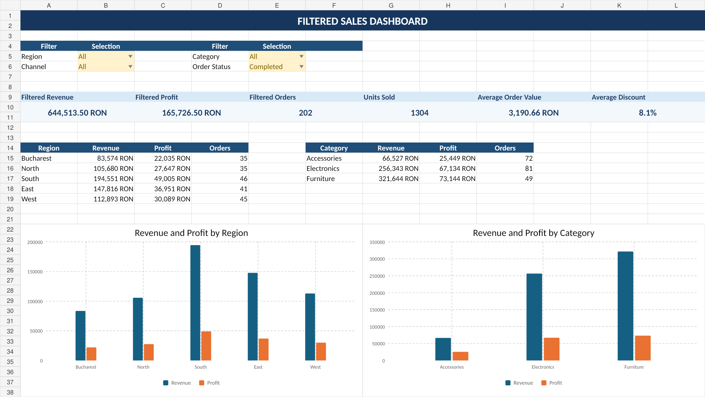
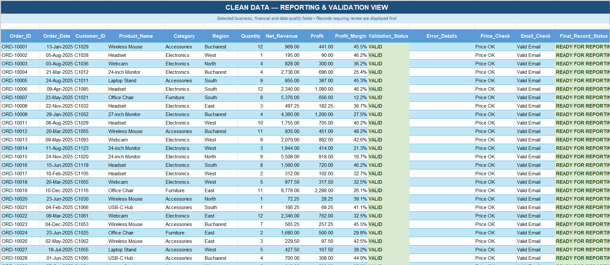
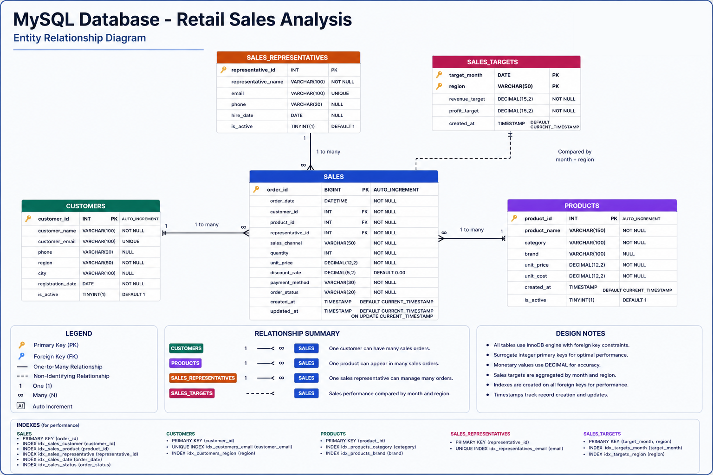
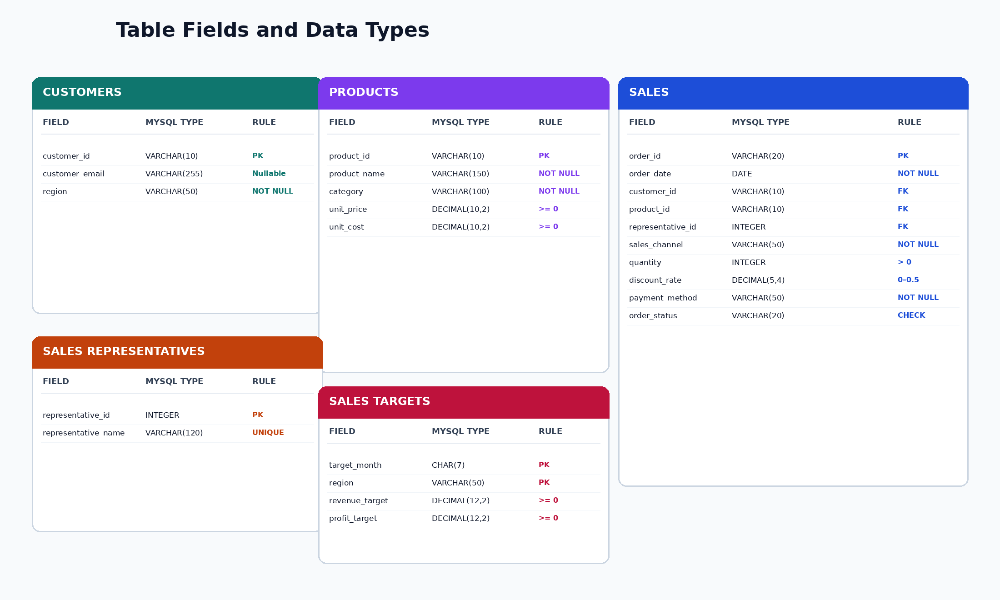

# Retail Data Quality System — Excel + MySQL

A complete portfolio project focused on **Microsoft Excel, data quality, master data, business reporting and MySQL**.

The project simulates a realistic retail workflow in which monthly sales files are consolidated, checked against validation rules and master data, cleaned, reported in Excel and analysed separately in MySQL.

### Filtered sales dashboard



### Data-quality checklist



## Business scenario

A retail company receives monthly sales records from multiple channels and regions. Before the information can be used for reporting, the records must be checked for missing fields, duplicate order IDs, invalid customer emails, unknown products, invalid quantities, incorrect prices and inconsistent master data.

The project demonstrates how a junior data professional can organise this process using Excel formulas and MySQL.


## Project workflow

1. Twelve monthly CSV files are stored in `data/monthly_sales_files/`.
2. The combined source dataset is represented by `data/retail_sales_raw.csv` and the `Raw_Data` worksheet.
3. Formula-based rules validate and enrich each record in `Clean_Data`.
4. Invalid or suspicious records are summarised in `Error_Report`.
5. Data-quality KPIs are displayed in `Quality_Checklist`.
6. Valid records feed the dashboards and target-versus-actual reports.
7. The same retail business scenario is modelled separately in MySQL for relational analysis.

> The Excel workbook and MySQL database are separate portfolio components. The workbook does not use a live MySQL connection.

## Dataset reconciliation

- Raw dataset: **300 rows**
- Clean CSV: **288 rows**
- Removed from the clean export: invalid records and one repeated occurrence of duplicate order ID `ORD-10201`
- The intentionally invalid examples include missing identifiers, malformed emails, unknown products, invalid quantities, negative prices, excessive discounts and missing required values.

This difference is intentional and demonstrates a realistic data-cleaning process rather than a perfect source dataset.

## Excel workbook

The workbook contains 12 worksheets:

| Worksheet | Purpose |
|---|---|
| `Dashboard` | Overall KPI and performance reporting |
| `Filtered_Dashboard` | Interactive reporting using dropdown filters |
| `Target_vs_Actual` | Comparison of monthly and regional targets with actual results |
| `Quality_Checklist` | Summary of validation results and data-quality KPIs |
| `Error_Report` | Records requiring correction or review |
| `Clean_Data` | Formula-enriched and validated transaction table |
| `Raw_Data` | Original source records |
| `Master_Data` | Approved product and reference information |
| `Settings` | Configurable thresholds and business rules |
| `Lookups` | Lists used by formulas and validation |
| `Data_Validation` | Validation examples and controlled input lists |
| `New_Order_Form` | Structured example for entering a new order |

## Excel skills demonstrated

- formula-driven data cleaning and validation;
- product and customer master-data verification;
- duplicate, missing-value and malformed-email detection;
- `IF`, nested `IF`, `IFERROR`, `AND` and `OR`;
- `COUNTIF`, `COUNTIFS`, `SUMIF`, `SUMIFS` and `AVERAGEIF`;
- `VLOOKUP`, `SEARCH`, `ISNUMBER`, `LEFT`, `LEN` and `SUMPRODUCT`;
- date functions including `YEAR`, `MONTH` and `TEXT`;
- financial calculations for revenue, cost, profit and margin;
- configurable business rules through the `Settings` sheet;
- dropdown-driven dashboards and target-versus-actual reporting.

## MySQL component

### Database design





The SQL component contains:

### `sql/01_tables_and_data.sql`

- creates the `retail_data_quality` database;
- creates five InnoDB tables;
- defines primary keys, foreign keys, `CHECK` constraints and indexes;
- uses MySQL-compatible `VARCHAR`, `CHAR`, `DECIMAL`, `INTEGER` and `DATE` types;
- inserts customers, products, representatives, sales and monthly targets.

### `sql/02_sql_queries.sql`

Contains exactly **50 documented MySQL queries** covering:

- filtering and sorting;
- joins;
- aggregation;
- date analysis;
- subqueries;
- conditional aggregation;
- data-quality checks;
- management KPIs;
- target-versus-actual reporting.

## Skills demonstrated

- Excel data cleaning and formula-based validation
- Master-data verification
- Duplicate and missing-value detection
- Financial KPI calculation
- Interactive dashboard creation
- Target-versus-actual reporting
- Relational database design
- MySQL joins, aggregations and quality checks
- Business reporting and technical documentation

## Requirements

- Microsoft Excel
- MySQL Server 8.0 or newer
- MySQL Workbench, MySQL command-line client or another compatible SQL client

## How to run the MySQL project

### MySQL Workbench

1. Connect to a local MySQL Server.
2. Open and execute `sql/01_tables_and_data.sql`.
3. Open `sql/02_sql_queries.sql`.
4. Execute the queries individually and review the results.

### MySQL command line

```bash
mysql -u root -p < sql/01_tables_and_data.sql
mysql -u root -p retail_data_quality < sql/02_sql_queries.sql
```
